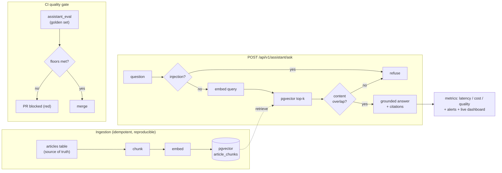

# GIGGO Knowledge Assistant - Design & LLMOps

A retrieval-augmented (RAG) assistant over the Knowledge Hub, built so the
*operations* around it - evaluation, a CI quality gate, observability, cost
control and guardrails - are the point, not just the feature.

## The problem
The Knowledge Hub has help articles (bookings, payments/escrow, safety,
verification). Users ask questions in their own words. We want an assistant that
answers **using only those articles**, **cites its sources**, and **refuses when
the answer isn't in the corpus** - and, crucially, one we can measure and safely
ship, so a worse version never reaches users.

## Architecture



**Pipeline.** Ingestion (`app/services/assistant/ingest.py`) reads published
articles, splits them into overlapping chunks, embeds them, and upserts into a
`pgvector` table - idempotent, so re-running after an edit is safe. At query time
(`/assistant/ask`) the question is embedded, the nearest chunks are retrieved by
cosine distance, guardrails decide answer-vs-refuse, and the answerer returns a
grounded reply with citations back to the source articles.

**Seams (keyless by default).** Both models sit behind config-selected backends
(ADR-0013): embeddings default to a local sentence-transformer with a
deterministic hashed fallback (so CI needs no torch); answer generation defaults
to a keyless **extractive** answerer that builds the reply from the retrieved
chunks and therefore **cannot hallucinate**. A hosted LLM is a one-line swap.

## LLMOps (the portfolio value)
- **Evaluation** (`evaluation/assistant_eval.py`) - a golden set scored for
  retrieval hit-rate, citation correctness, groundedness and refusal, run over an
  in-memory index (no DB) so it works anywhere. Baseline: 0.90 / 0.90 / 0.97 / 1.00.
- **CI quality gate** - the eval runs in CI; a PR that drops any metric below its
  floor turns the check red and **cannot merge**.
- **Guardrails** - a content-word overlap gate refuses off-topic questions even
  with the weak hashed embedder (cosine alone can't, because stop-words overlap),
  plus prompt-injection detection.
- **Observability & cost** - a metric per `/ask` (latency, tokens, estimated cost,
  grounded/refused), a `/metrics` snapshot with p50/p95/p99 + alerts, and a
  self-contained live dashboard. Local cost is $0; a hosted backend's cost is
  tracked and alerted on.
- **Reproducibility & rollback** - versioned prompts, a pinned embedding model, a
  one-command index rebuild, and a documented gate-plus-config-swap rollback
  (ADR-0014).

## Trade-offs (and what was rejected)
- **pgvector on the existing Postgres**, not a dedicated vector DB (Pinecone/
  Qdrant) or an in-memory index - no new infrastructure at this corpus size
  (ADR-0012). This is a bounded exception to the stateless-ML-service rule
  (ADR-0003): the index is derived, rebuildable state; `articles` stays the source
  of truth.
- **Extractive local default** over a local generative LLM - free, offline, and
  hallucination-proof; the eval measures the gap a hosted LLM would close.
- **Hashed-embedder fallback** so CI stays light (no torch); the eval floors sit
  below the hashed baseline and rise with the real backend.
- **Refusal via a content-overlap gate**, not a cosine threshold alone - a
  threshold cannot separate off-topic from on-topic when only stop-words overlap.

## Run it
```
cd ml-service
make install-rag        # optional: real embeddings + Postgres client
docker compose up -d     # Postgres (pgvector) + Redis   (from repo root)
# start the backend once so Flyway applies V33 (article_chunks)
make ingest              # build the index from published articles
make serve               # dashboard at /api/v1/assistant/dashboard
make eval                # the quality gate, locally
```
See [`adr/0012`](adr/0012-retrieval-store-for-knowledge-hub.md),
[`adr/0013`](adr/0013-llm-provider-seam.md), [`adr/0014`](adr/0014-rag-rollout-and-rollback.md),
and [`ml-service/evaluation/README.md`](../ml-service/evaluation/README.md).
